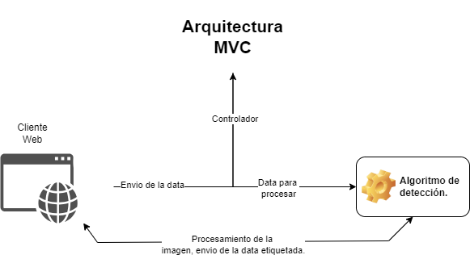

# RecycleWise: Revolucionando el reciclaje através de la tecnología

RecycleWise es una aplicación web basada en Django que tiene como objetivo mejorar los esfuerzos de reciclaje en todo el mundo. Mediante la integración de algoritmos de machine learning, nuestro proyecto ofrece un sistema de detección inteligente que identifica con precisión varios tipos de materiales reciclables a partir de video en tiempo real. Este proyecto no solo busca hacer que el reciclaje sea más accesible y eficiente, sino que también tiene como objetivo educar e involucrar a la comunidad sobre la importancia del reciclaje para la sostenibilidad ambiental.
    
<h1 align="center">IMÁGENES DEL FUNCIONAMIENTO DEL PROYECTO</h1>
<br>


## Características principales

- **Detección Avanzada de Materiales**: En el corazón de RecycleWise está su potente capacidad de detección de materiales, impulsada por un modelo de machine learning (`modelos/best.pt`). Este modelo puede distinguir entre diferentes materiales reciclables, como plásticos, metales, vidrio y papel, con una precisión media-alta.

- **Interfaz de Usuario Interactiva**: La aplicación cuenta con una interfaz web fácil de usar que simplifica el proceso de detección de materiales. Está diseñada para garantizar una experiencia fluida para usuarios de todas las edades.

## Especificaciones técnicas

- **Framework Backend**: Django 5.0.6, elegido por su escalabilidad y facilidad de uso en la construcción de aplicaciones web complejas.
- **Biblioteca de Aprendizaje Automático**: PyTorch, utilizado para entrenar e implementar el modelo de detección de materiales.
- **Tecnologías Frontend**: HTML5, CSS3 y JavaScript, asegurando una interfaz web moderna y receptiva.
- **Base de Datos**: SQLite (por defecto), con soporte para PostgreSQL en entornos de producción.

- **DataSet / Conjunto de datos**: Se utilizo una dataset libre, el cual cuenta con una cantidad decente de 1500 imagenes, para fines de etiquetado. [Plastic Waste DataBase of Images – WaDaBa. Bobulski J., Piatkowski J.(2018)](http://wadaba.pcz.pl/#download)

- **Procedo de etiquetado:** Se utilizó `Grounding Dino` para el etiquetado de las imagenes anteriores.


## Arquitectura del proyecto:

<h1 align="center">



</h1>

## Metricas del proceso de entrenamiento:

### Curva de precisión y confidencia:


### Curva de confidencia:


## Comenzando con RecycleWise

### Prerrequisitos

Antes de comenzar, asegúrate de tener instalado lo siguiente:
- Python 3.8 o superior
- Django 5.0.6
- PyTorch (para ejecutar el modelo de aprendizaje automático)
- Otras dependencias listadas en `requirements.txt`

### Guía de Instalación

1. **Clonar el Repositorio del Proyecto**:
   ```sh
   git clone https://github.com/tuusuario/RecycleWise.git
   ```

2. **Navegar al Directorio del Proyecto**:
   ```sh
   cd RecycleWise
   ```

3. **Crea un entorno virutal:**
   ```sh 
   python -m venv nombre_de_tu_entorno
   ```

4. **Entrar al entorno virtual:**
   ```sh
   .\nombre_del_entorno\Scripts\activate # CMD
   ```
   ```sh
   ./nombre_del_entorno/Scripts/activate # Powershell
   ```

5. **Instalar Paquetes Python Requeridos**:
   ```sh
   pip install -r requirements.txt
   ```

6. **Configuración de la Base de Datos**:
   Aplica las migraciones de Django para configurar el esquema de tu base de datos:
   ```sh
   python manage.py migrate
   ```

7. **Iniciar el Servidor de Desarrollo**:
   Corre la aplicación localmente:
   ```sh
   python manage.py runserver
   ```

## Cómo usar la app

Después de correr el servidor puedes acceder a la aplicación yendo a la URL `http://127.0.0.1:8000/` en el navegador. La detección de objetos es en vivo, por lo que solo debes poner un objeto delante de la cámara y será reconocido y clasificado deacuerdo al material.

## Desarrollo y personalización

- **Modelos**: Mejora o personaliza los modelos de base de datos dentro de `detection/models.py` para ajustarse a tus requisitos específicos.
- **Vistas**: Implementa o modifica la lógica de la aplicación en `detection/views.py` para controlar cómo se procesan y presentan los datos.
- **Archivos Estáticos**: Puedes actualizar el aspecto y la sensación de la app modificando los estilos CSS en `static/css/style.css`.

## Contribuir a RecycleWise

Damos la bienvenida a las contribuciones de desarrolladores, ambientalistas y cualquier persona apasionada por el reciclaje. Ya sean correcciones de errores, mejoras de características o mejoras en la documentación, su aporte es valioso. Puedes hacer un fork del repositorio o crear un pull request para ser revisado y aprobado.


## Créditos y referencias:
Banco Mundial. (2018). What a Waste 2.0: A Global Snapshot of Solid Waste Management to 2050. Retrieved from World Bank.

Sánchez, S. (2023). AprendeIngenia/recyclingAI. Hugging Face. https://huggingface.co/AprendeIngenia/recyclingAI/tree/main/Modelos 

*Especial mención a Santiago Sanchez de aprende-ingenia, quien entrenó dicho modelo para que pueda ser usado por la comunidad.*

Mikołajczyk, A. (2024). Waste Dataset Review. GitHub. https://github.com/AgaMiko/waste-datasets-review

Dataset, usado:

Bobulski J., Piatkowski J., PET waste classification method and Plastic Waste DataBase WaDaBa, Conference Proc. IP&C 2018, Advances in Intelligent Systems and Computing, vol. 681, Springer Verlag, 2018, pp.57-64.[PDF](http://wadaba.pcz.pl/#download)

Bobulski J., Kubanek M., Deep Learning for Plastic Waste Classification System, Applied Computational Intelligence and Soft Computing, 2021, art. no. 6626948 DOI: 10.1155/2021/6626948 
http://wadaba.pcz.pl/#download


## Collaborators behind the scene:
- ✨ Edwin Roman.
- ✨ Braily Roman (The Goat).
- ✨ Samil  Quezada.
- ✨ Franyel Sánchez.
